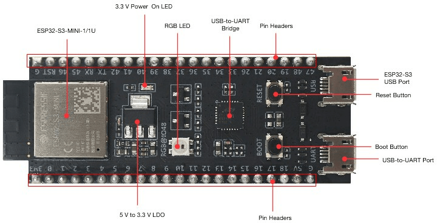
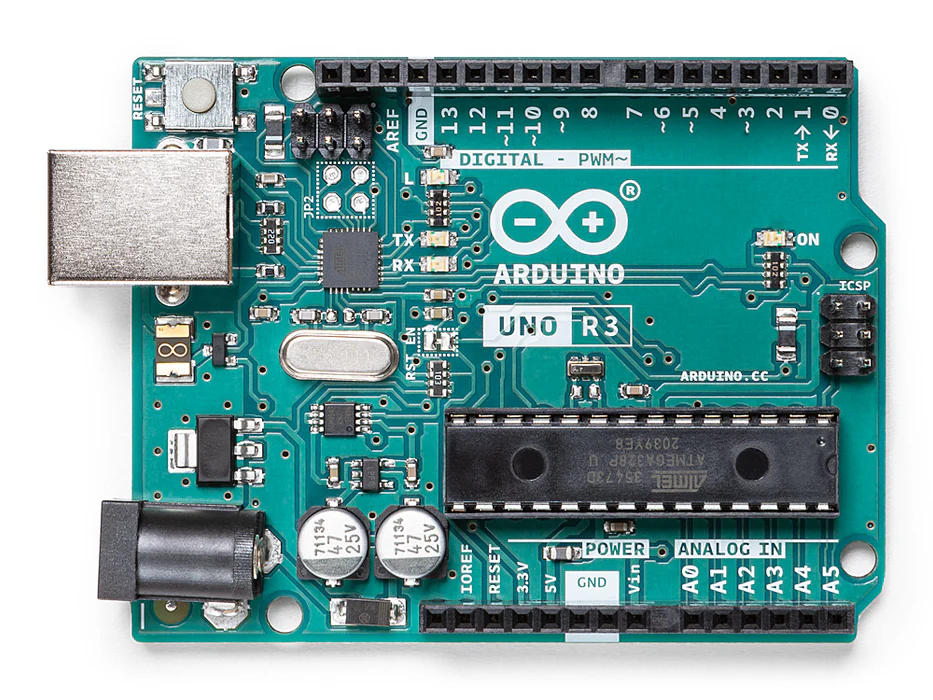
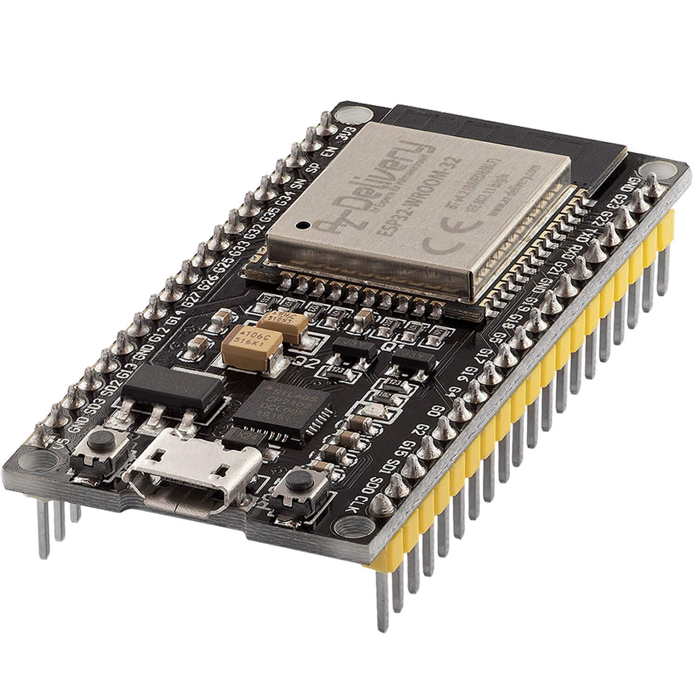

# Robotics-Tasks
# Coding Domain
## Research and Study
The output demonstration video has been uploaded to Google Drive and can be accessed using the link provided below.
https://drive.google.com/drive/folders/1F-xGM8YQBeJsN1WESzYnb6wH9iPyfPYY?usp=sharing
The video file exceeds GitHub’s 100 MB upload limit. Therefore, it has been shared via Google Drive.
### Arduino IDE Basics
Arduino IDE (Integrated Development Environment) is a beginner-friendly, high-level coding environment that uses programming structure of C/C++.
#### Arduino programming structure
**Sketch** -a sketch is simply the program you write to run on an Arduino board.
**Structure**
Software structure consist of two main functions:
- **Setup( ) function**: The setup() function is called when a sketch starts. It can be used to initialize the variables, pin modes, start using libraries, etc. The setup function will only run once, after each power up or reset of the Arduino board.
- **Loop( ) function**: After creating a setup() function, which initializes and sets the initial values, the loop() function does precisely what its name suggests, and loops consecutively, allowing your program to change and respond.

**Some other functions** -
- **pinMode ( )**: The pinMode() function assigns a specific PIN as either INPUT or OUTPUT.
Pin: It is used to specify the PIN which depends on the project requirements. 
Mode: Depending on whether the pin is taking INPUT or OUTPUT, it specifies the pin's function.
 Syntax: 
  pinMode (pin, mode);
 Example 
  pinMode (13, INPUT);

  PinMode in OUTPUT mode:
   Setting pinMode to OUTPUT is important for some pins. This mode allows the specified PIN to supply sufficient current to another circuit to activate the sensor or light the LED. When set to OUTPUT, this pin goes into a very low impedance state, making the current useful. It is important to note that excessive current or short circuits between pins can damage the Atmel chip. This explains the need for setting the mode to OUTPUT.

  PinMode in INPUT mode:
   When digitalWrite() is used, selecting the INPUT mode for any pin turns off the low state and sets the high state as the ultimate state. The INPUT mode can be employed alongside an external pull-down resistor. For this purpose, pinMode should be set to INPUT_PULLUP. This configuration reverses the behavior of the INPUT mode. In INPUT_PULLUP mode, a sufficient current is provided to light an LED connected to the pin dimly. If the LED emits a dim light, it signifies that this condition is operational.

Given these considerations, it's advisable to set the pin to OUTPUT mode to ensure proper functionality.

- **digitalWrite( )**
The digitalWrite( ) function is used to decide the value of the pin. It can be set as either of the two values, HIGH or LOW.

  HIGH: For a board that is supplied with a maximum of 1V, it results in a 5V value whereas on a board with other values like 6V, it updates the value to 6V.  
  LOW: It sets the pin to the ground by setting a reference of 0V. 
  If no pin is set with pinMode as OUTPUT, the LED may light dim.

  syntax: 
    digitalWrite( pin, value HIGH/LOW)
  Pin: We can specify the PIN or the declared variable.

  Example: 
  digitalWrite (6, HIGH);  
  digitalWrite (6, LOW);

- **delay ( )**
  The delay() function serves as a tool to halt program execution for a specified duration, measured in milliseconds. We have seen how delay(5000) signifies a stop of 5 seconds. 
  This can be understood by the fact that 1 second equals 1000 milliseconds.

  Example: 
  digitalWrite (12, HIGH);  
  delay (5000);  
  digitalWrite (12, LOW);  
  delay (2000);

**Arduino - I/O Functions**
- Arduino pins are by default configured as inputs
  Input pins make extremely small demands on the circuit that they are sampling, equivalent to a series resistor of 100 megaohm in front of the pin. 
  This means that it takes very little current to switch the input pin from one state to another. This makes the pins useful for such tasks as implementing a capacitive touch sensor or reading an LED as a photodiode.

- Pins configured as OUTPUT with pinMode() are said to be in a low-impedance state. This means that they can provide a substantial amount of current to other circuits. This is enough current to brightly light up an LED.
  Attempting to run high current devices from the output pins, can damage or destroy the output transistors in the pin, or damage the entire Atmega chip. Often, this results in a "dead" pin in the microcontroller but the remaining chips still function adequately.

pin − the number of the pin whose mode you wish to set 
mode − INPUT, OUTPUT, or INPUT_PULLUP.

#### How does Arduino knowledge helps in learning ESP-IDF?
In comparision Arduino is easier than ESP-IDF. But since Arduino framework is designed to be simple, lots of concepts are still left out.
Arduino teaches you what embedded systems do while ESP-IDF teaches you how they really work inside. 
ESP-IDF is written in C. It’s actually a good thing because as a framework, it should ensure interoperability with many other languages. C is the lowest common denominator for embedded programming. 
Since ESP-IDF is based on C and supports OOP in C++, variables, loops, and conditional logic are easy to understand because they are already familiar from Arduino.

- In Arduino, pinMode() to set a pin as input or output and digitalWrite() or digitalRead() to control or read it. In ESP-IDF, GPIO setup is more detailed, but the logic is the same as Arduino.

- Arduino experience also makes hardware concepts easier to grasp. Things like pull-up and pull-down resistors, logic voltage levels (HIGH/LOW), and how pins behave as inputs or outputs are already familiar. ESP-IDF uses the same electrical principles in which they are more explicitly more configured and with deeper control over how each pin behaves.

- Arduino functions uses delay(), millis(), Blocking and non-blocking delay and includes control logic.
In ESP-IDF, RTOS delays (vTaskDelay), Hardware timers are used .
The concept of time-controlled execution is already understood which working with Arduino.

- Arduino teaches Serial debugging which includes Serial.begin, Serial.println.
ESP-IDF uses UART drivers, but Ssme communication principles and same debugging workflow as Arduino. 

- Since having Arduino background you have experience with Sensors & Protocols such as I2C devices, SPI modules, Analog sensors.
This builds understanding of Communication protocols, Device addresses, Data exchange.
ESP-IDF requires manual driver setup, but concepts are familiar.

- Infinite main loop logic, Hardware dependent behavior, Timing critical operations, Memory limitations, Debugging hardware and software together are core habits developed while working with Arduino. These fundamentals directly translate to ESP-IDF, making it easier to understand low-level control, task timing, system resources, and debugging.

- ESP-IDF uses FreeRTOS.
Prior experience with delays and task-like logic makes understanding tasks, parallel execution
much easier.

- Arduino libraries hide low-level details like drivers, peripheral setup, and communication. ESP-IDF exposes these internals. How driver initialization, interrupts, memory, and networking is handled.

- Transfer Directly, Checking wiring, Identifying power issues, Understanding signal problems etc these practical skills remain identical when working with ESP32 using ESP-IDF.

### ESP32 Software Stack
#### What is ESP32?
The ESP32 is a 32-bit microcontroller developed by Espressif Systems. It features Wi-Fi and Bluetooth connectivity, making it ideal for Internet of Things(IoT) projects that require wireless communication. This is a low-cost, energy-efficient system on a chip (SoC) Microcontroller.

  

#### What is ESP32 used for?
The ESP32 is commonly used in IoT projects, smart home systems, wearables, security devices, environmental monitoring, and more. Its wireless capabilities and versatility make it ideal for creating connected devices.

- **IoT devices**: The ESP32 is often used to build IoT devices due to its built-in Wi-Fi and Bluetooth capabilities. It can be used to create smart home devices, environmental sensors(temperature, humidity, air quality sensors) and more.

- **Home automation**: ESP32-based devices can control lights, thermostats, and other home appliances through Wi-Fi or Bluetooth connections, making it a popular choice for DIY home automation projects.

- **Wireless communication**: It can be used for wireless communication in various applications, such as creating mesh networks, remote control systems, and data transmission between devices

- **Robotics**: ESP32 can be used as the control unit in robotics projects, providing wireless control and communication capabilities to robots.

- **Wearable devices**: Due to its compact size and low power consumption, the ESP32 is suitable for wearable IoT devices, including smartwatches, fitness trackers, and health monitoring products.

- **Industrial automation**: ESP32 microcontroller can be integrated into industrial systems for remote monitoring and control, as well as for predictive maintenance. This is a great ally for industrial IoT applications, since companies can improve their operations with the help of this technology.

- **Environmental monitoring**: It can be used to build environmental monitoring systems for measuring air quality, pollution levels, and weather conditions.

- **Education and prototyping**: The ESP32 is popular in educational settings for teaching electronics and programming due to its affordability and versatility; in fact, we built something cool with an ESP32 board – How to build a mechanical 7 segment display clock.

- **Security Systems**: It can be used in DIY security systems, including cameras, alarms, and access control systems.

- **Healthcare**: ESP32 can be used in several healthcare solutions, such as patient monitoring, medication reminders, and telemedicine devices.

#### What is the role of ESP32 in Robotics system?
ESP32 in a robot handles three major roles
- **Communication** : Unlike older microcontrollers, the ESP32 has built-in Wi-Fi and Dual-mode Bluetooth. This allows a robot to: 
  - Remote Control: can be operated via phone and apps like Dabble.
  - Receive new code wirelessly without being plugged into a computer.
  - Send real-time sensor data back to a central server or PC for analysis.

- **Hardware control** : The ESP32 features a rich set of Peripheral Interfaces that allow it to interact directly with robotic hardware:
  - Pulse Width Modulation (PWM): Used to control the speed of DC motors and the precise positioning of Servo motors.
  - I2C/SPI: To communicate with complex sensors like IMUs (Inertial Measurement Units), Lidars.
  - Capacitive Touch: Can be used to create "skin" sensors for human-robot interaction.

- **MultiTasking**: for example reading a sensor while driving a motor. ESP32 handles this because of
  - Dual core Processor: one of the core maintains Wi-Fi connection while other focuses on robot's logic and movements.

#### Arduino vs ESP-IDF
##### **Arduino**
The Arduino IDE is a beginner-friendly, high-level programming environment originally designed for Arduino boards. Over time, it has gained support for ESP32 and other microcontrollers. It is an open-source environment which consist of hardware and software(IDE).
- Hardware such as Arduino UNO, NANO or Portenta like boards.
- Software (IDE) - A simplified coding environment that uses programming structure of C/C++.

  

**Features**
- Install Arduino IDE, add the ESP32 board manager URL, and you’re ready to program.
- Thousands of ready-made libraries for sensors, displays, Wi-Fi, BLE, and more.
- If you know Arduino, you can quickly move to ESP32.
- Perfect for small IoT projects, LED blinks, sensors, and basic automation.

**Limitations**
- **Limited FreeRTOS Control**: ESP32 internally runs FreeRTOS, but Arduino abstracts most of it.
- **Less Performance Optimization**: Slower compile times and slightly larger binaries compared to ESP-IDF.
- **Lower Control**: Hardware and peripherals are accessed through libraries, limiting low-level optimization.

For beginners who are just starting in robotics Arduino is the best choice since it doesn't need complex multitasking or precise hardware control unlike ESP-IDE.

##### **ESP-IDF**
ESP-IDF, or Espressif IoT Development Framework, is an official development framework for ESP32 series of microcontrollers. The ESP IDF framework provides a set of libraries, tools, and APIs for developing ESP32 microcontroller based applications. It offers a wide range of features, commonly needed for the IoT applications and is designed to provide a comprehensive and flexible platform.
One of the main advantages of ESP-IDF framework is that it fully supports both standard C and standard C++ programming languages, which allows to write efficient, high-performance code.
Unlike Arduino, it provides full access to the hardware and deep FreeRTOS integration.

  

**Features**
- **Native FreeRTOS Support**: Create tasks, set priorities, use queues and semaphores.
- **Full Hardware Control**: Access all peripherals with precise timing and configuration.
- **Better Performance**: Smaller binaries, optimized runtime, and better memory management.
- **Professional Environment**: Compatible with VS Code, Eclipse, and supports JTAG debugging.

**Limitations**
- Beginners may find the APIs complex.
- Requires installation of Python, Git, toolchains, and environment variables.
- Fewer Plug-and-Play Libraries: Many Arduino libraries need porting to ESP-IDF.

  
  

The Arduino code was compiled and tested on Arduino UNO. 
The ESP-IDF example is shown to demonstrate the FreeRTOS-based workflow and API structure. 

Notice the use of FreeRTOS vTaskDelay instead of Arduino’s delay(). This allows other tasks to run concurrently. 

ESP-IDE is the best for professional and large scale projects since it provides  full control over FreeRTOS tasks and priorities and optimized performance and precise timing.